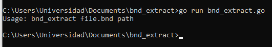
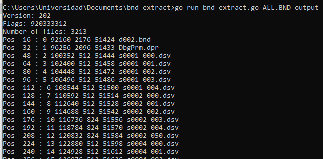

# BNDExtract

 Extractor de archivos BND para el videojuego Kuon (2004) 
 
Para compilar:
```
go build bnd_extract.go
```

Uso:
```
bnd_extract archivo.bnd ruta_a_extraer
```

## Características

- Soporta el archivo ALL.BND presente en algunos juegos de PS2 lanzados por From Software (principalmente, el del videojuego Kuon del año 2004)

## Stack

- Lenguaje de programación Go

## Arquitectura

- Al ser una herramienta considerada para ser parte de una pipeline más grande, no tiene una arquitectura definida en sí.

## Screenshots


